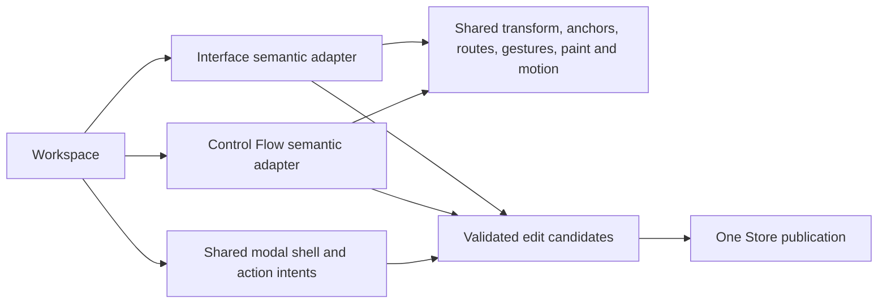

# UI coherence qualification — 2026-09-14

Implementation and automated/native checks passed. **The owner's walkthrough is
pending.** Nothing was merged and no release was published. These are scratch UI
fixtures, not an accepted Foundry Method design or the owner's working document.

## Verified revisions

Inspected baseline and initial local/remote HEAD:
`731bfef294c2c624def47d41a169b231713ffcbc`. The initial tree was clean; fetching
the requested branch found no newer work to reconcile. All checkpoints were
committed on `work/add-logic-diagramming` and pushed normally.

| SHA | Checkpoint |
| --- | --- |
| `c433f1c1e411a0c245b7c493367f5cfd553ebe93` | Contract, audit, baseline warnings and failing signed-layout regressions |
| `986789cbac3a07a72be4d2ade84b9bfa8358ec03` | Production mechanics, signed layouts, contextual commands and shared dialogs |
| `bdba2c3c6c0ff00d91b85df54086d8d50a21c12c` | Warning repairs, CI gate, guidance and application self-design |
| `519378d786c423c7635ca091fc51bc00bc968828` | Compact title/actions aligned in one fixed header row |
| `862159575669895bf0772cc4b3fcfe8d4d83efc4` | Repair emitted CI action-runtime/dependency deprecations |
| `a0bd918613b03fb13eece9bfe4b701448d70b02d` | Repair native-discovered same-frame Shift+nudge; final qualified code |

All `final-*.png` screenshots here use the ordinary release executable built from
the clean final code revision above. Linux binary SHA-256:
`8dc848ba2dac5ddfb3c6f07cbcd0be0cefb8d6e64c0ea77cb65701aef8c59239`.
The baseline screenshots use the exact baseline binary, SHA-256
`d5acdfa8a8352caaadcb2edb551aafad115a6355e188d7011d8c12ca8f35150d`.
The evidence-only commit containing this report does not alter production code.

## Warning-free qualification

[CI run 34802501738](https://github.com/lgardner-dev/System-Designer/actions/runs/34802501738)
completed successfully on Ubuntu 24.04, Windows and macOS. Every required command
passed on each platform: formatting, all-target/all-feature tests, headless tests,
both configured-Clippy matrices, doctests, rustdoc, both release binaries and the
application self-design check. CI also passed branding and native packaging;
Linux installer install/uninstall was exercised in an isolated prefix.

| Evidence | Result |
| --- | --- |
| [Local manifest](local/manifest.json) and its nine complete command logs | All exit codes zero; no emitted warnings |
| [Linux manifest](ci-linux/manifest.json), [complete job log](ci-linux/complete-job.log) | All gates and installer round trip passed |
| [Windows manifest](ci-windows/manifest.json), [complete job log](ci-windows/complete-job.log) | All gates, NSIS installer and PE/icon checks passed |
| [macOS manifest](ci-macos/manifest.json), [complete job log](ci-macos/complete-job.log) | All gates, app bundle and DMG passed |

The logs are complete stdout/stderr, not filtered excerpts. Every command and its
exit code, exact source SHA, compiler, target and composed flags are retained in
the corresponding manifest. Windows explicitly retains `-C target-feature=+crt-static`
alongside `-D warnings`. Cargo.lock and dependency versions were preserved.

There are **227 all-target tests: 87 library/UI and 140 integration/domain tests**.
The headless configuration executes **140 tests**. Doctests execute zero tests;
rustdoc still compiles the documentation under denied warnings. These are counts
from one run, not sums across platforms or repeated qualifications. The existing
215 all-target/136 headless obligations remain; no test was deleted. F2's former
triangle-specific arrow assertion was updated for the shared stroked arrow wings
and augmented with actual painted-handle/route agreement. F1, F2, F3 and R1–R4 pass.

Baseline configured Clippy emitted 63 distinct findings: 25 library, one additional
library-test and 37 behavior-test findings. [Its full log](baseline-clippy.log)
is retained as historical failure evidence. Repairs and rationale are in
[the coherence contract](../../UI-COHERENCE.md). First CI qualification exposed
deprecated Node 20 actions and bundled punycode/url.parse notices; supported
Node 24 action releases resolved them. Final complete job logs contain none.
Rustup's first explicit toolchain activation reported an auto-install deprecation;
the installed compiler remains the initially inspected Rust 1.98.1. No warning was
hidden by a downgrade, suppression, ignored failure or removed feature.

The same verification wrapper was tested destructively only in a temporary clean
checkout at `bdba2c3`. An unused binding failed the compiler gate with exit 101
([log](gate-rustc/self-design.log)); a public Option unwrap failed configured Clippy
with exit 101 ([log](gate-clippy/clippy-headless.log)). Removing each probe restored
passing gates ([compiler](gate-restored-rustc/self-design.log),
[Clippy](gate-restored/clippy-headless.log)). No probe or lint suppression remains.

## Native environment and method

Ubuntu 24.04, GNOME Wayland desktop, Linux 7.0.0-31; X11 client through Xwayland,
and a separate native Wayland client through Weston 13 kiosk shell nested on X11.
Both ran the same final executable with `LIBGL_ALWAYS_SOFTWARE=1`.
[Renderer evidence](native/renderer.log) identifies Mesa 25.2.8 llvmpipe
(LLVM 20.1.2); hardware acceleration is not qualified.

Actual OS pointer/key events were injected with XTEST into the native application.
For Wayland they passed through the Weston host window into its Wayland client.
Coordinates account for the window-manager frame (47 px left, 73 px top at 100%).
The harness explicitly raised/focused windows. An exploratory Alt+F4 injection
did not close its client; those extra windows were closed with WM_DELETE_WINDOW,
and reopen checks were repeated with one verified live client. Subsequent native
closures used the application's File > Exit or WM_DELETE_WINDOW, not a forced kill.
The final X11 process was reopened after both earlier X11 clients had exited.

No system packages were installed: Xlib/XTEST helpers and Weston came from Ubuntu
packages extracted into `/tmp`. Relocated Weston's first setup reported a missing
decorative `/usr/share/weston/wayland.png`; kiosk rendering and application input
worked. An initial non-software EGL attempt was replaced with the explicit software
configuration. These setup accommodations do not establish GPU or desktop-Wayland
qualification beyond the disclosed nested environment. Final application stdout/stderr
logs are preserved under [native](native/) and contain zero diagnostics.

Client sizes exercised: 1440×900 and 1600×960 at 100% UI scale, and 1280×720,
1600×960 and 1920×1080 at 150% using egui's Ctrl+= UI scaling independently of
canvas zoom. Screenshots include full compositor/window frames, so PNG dimensions
are larger than the client sizes. The full-workspace raw-input tests separately
cover all three acceptance sizes at scale 1.0/1.5, including body top/middle/bottom.

## Native tasks and visible results

The primary journey started with `before-extraction.project.json`. All document
edits below were made through the ordinary GUI. The returned proposal was prepared
by changing only its writable transition list after copying a genuine GUI export.
Saved JSON was read afterward to verify exact results; no diagram was repositioned
or repaired by editing JSON. Scratch outputs and [result assertions](native/results.json)
are retained.

1. In Control Flow, entered a 90-paragraph project purpose, scrolled to the bottom,
   inserted a newline and the final `z`, and clicked the visible top-right Save
   details. Ctrl+S wrote the file. [Top](screenshots/final-purpose-top.png),
   [bottom](screenshots/final-purpose-bottom.png),
   [1280×720 at 150%](screenshots/final-1280x720-scale150-bottom.png),
   [1600×960 at 150%](screenshots/final-1600x960-scale150-bottom.png),
   [1920×1080 at 150%](screenshots/final-1920x1080-scale150-bottom.png).
   Tab/Shift-Tab retained visible modal focus; multiline Enter added a newline.
2. Renamed Validate to Validate source record, used Fit, and moved the root entry
   through both axes while the pointer remained in the canvas. Its saved position
   became approximately (-42.328, -52.328). No fit/rebase followed that gesture.
   [Signed movement](screenshots/final-root-both-negative.png).
3. Declared Source record input and Stored receipt output with visibly unassigned
   contracts. Escape dismissed the producer dropdown and retained its form
   ([screenshot](screenshots/final-popup-escape.png)). Selected three actions and
   previewed/extracted Record intake from the signed layout; relative positions
   and surviving root objects were retained.
   [Boundary preview](screenshots/final-boundary-preview.png).
4. Inspected the same component in Interfaces and explicitly defined/reviewed a
   Source record contract. The component port, parent information requirement and
   child requirement received the exact same contract ID/version. The output
   remained unassigned. Followed Uses in Control Flow to `call.1`, renamed its
   occurrence Ingest record, and entered Record intake.
   [Contract review](screenshots/final-contract-reviewed.png),
   [exact use](screenshots/final-return-use.png),
   [action label and canonical identity](screenshots/final-call-identity.png).
5. Moved the child entry through both axes, verified ten-unit Shift+nudge, used Back
   and returned to the child, then opened/cancelled global settings without losing
   that scope/selection. Saved child position after nudge: approximately
   (-71.308, -25.314). [Child movement](screenshots/final-child-negative.png),
   [child settings](screenshots/final-child-settings.png).
6. Dragged visible Out→In handles, supplied the `manual review` condition and saved.
   Reverse In→Out drag and click-to-connect opened the same semantic form and were
   cancelled. The published route ended at the displayed handles.
   [Forward](screenshots/final-forward-form.png), [reverse](screenshots/final-reverse-form.png),
   [click alternative](screenshots/final-click-form.png),
   [final route](screenshots/final-published-route.png).
7. Exported this child scope and returned a proposal removing only transition `t3`.
   Validation disclosed the exact removed return and two newly introduced draft
   issues before raw JSON; Cancel preserved all five transitions. Undo/Redo of the
   preceding real transition edit changed the count 5→4→5.
   [Removal review](screenshots/final-removal-review.png).
8. In Interfaces, Fit then dragged Record intake into negative X/Y, inspected the
   position form and nudged it. Saved (-115, -70). Added Audit receipt through
   +Step > Action and tested Undo/Redo of that real addition. Saved, closed and
   reopened; comparison of the entire parsed project was exact in both layers.
   [Position](screenshots/final-interface-negative-position.png),
   [created step](screenshots/final-new-action.png),
   [reopened flow](screenshots/final-reopened-flow.png),
   [reopened interfaces](screenshots/final-reopened-interface.png).

Additional ordinary-app fixture tasks:

- The same-endpoint return fixture preserved independent Accepted/Rejected selection
  with lights Off. Off→Selection retained the exact `accepted` transition; successive
  frames showed travel along that displayed route. Saving after display changes
  left the complete project equal to the original fixture.
  [Accepted](screenshots/final-accepted-off.png), [Rejected](screenshots/final-rejected-off.png),
  [owned popup](screenshots/final-lights-owned-popup.png),
  [selection retained](screenshots/final-selection-retained.png).
- The typed interface fixture opened identical producer/consumer forms for both
  pointer directions. Explicitly choosing T@1 created `edge.1` without changing
  its exact A.out/B.in endpoints; parallel and reciprocal routes remained separate.
  [Contract choice](screenshots/final-interface-contract-choice.png),
  [routes](screenshots/final-interface-parallel-routes.png).
  In A's interior, dragged X above/left of zero; its enclosing frame expanded while
  inherited A.in/A.out remained the owner's real ports with effective direction.
  [Before explicit refit](screenshots/final-boundary-crossed-axes.png),
  [frame after refit](screenshots/final-boundary-encloses-signed-child.png).
- The separate native Wayland process reopened the signed journey, edited its long
  purpose through the fixed header, moved root flow and interface objects further
  into negative coordinates, saved, and verified Shift+nudge. Final interface
  position (-405, -290), root entry approximately (-217.328, -222.328).
  [Purpose](screenshots/final-wayland-purpose-bottom.png),
  [flow](screenshots/final-wayland-signed-flow.png),
  [interfaces](screenshots/final-wayland-signed-interface.png).

## Shared responsibilities and remaining limits

The full before/after map, compatibility policy and research rationale are in
[UI-COHERENCE.md](../../UI-COHERENCE.md) and [the retained audit](assignment-audit.md).
The actual dependency direction is:

Diagram mechanics do not depend on mutable Designer, Store, contract acceptance or
disk I/O. Model/edit/exchange still compile without desktop features. Form dispatch
and semantic adapters remain Designer responsibilities; this is not a wholesale
application rewrite. The self-design describes these actual responsibilities.

Signed positions are deliberately bounded to ±1,000,000 finite world units in v3;
v1/v2 behavior is unchanged and there is no lossy downgrade. Transform tests use
zoom 0.2/1.0/2.5, signed pans and large coordinates with <=0.5 logical-pixel round-trip
tolerance. Both adapters test painted/hit-tested handles against final routes;
screenshots alone are not the geometry oracle. Store publication, recovery,
extraction/replacement preservation and golden packets remain regression-tested.

Windows/macOS GUI usability, hardware GPU rendering, standalone desktop-Wayland
behavior, screen-reader conformance and an OS reduced-motion preference bridge
remain unqualified. Lights Off is the available motion control; active-window,
modal and minimized gating are covered by the shared policy/tests. Native pointer
tasks were not repeated for every automated shape/zoom/pan combination. The owner's
actual Foundry draft was not available or altered. Owner task acceptance is still
required before merge/release; passing CI is not that acceptance.
